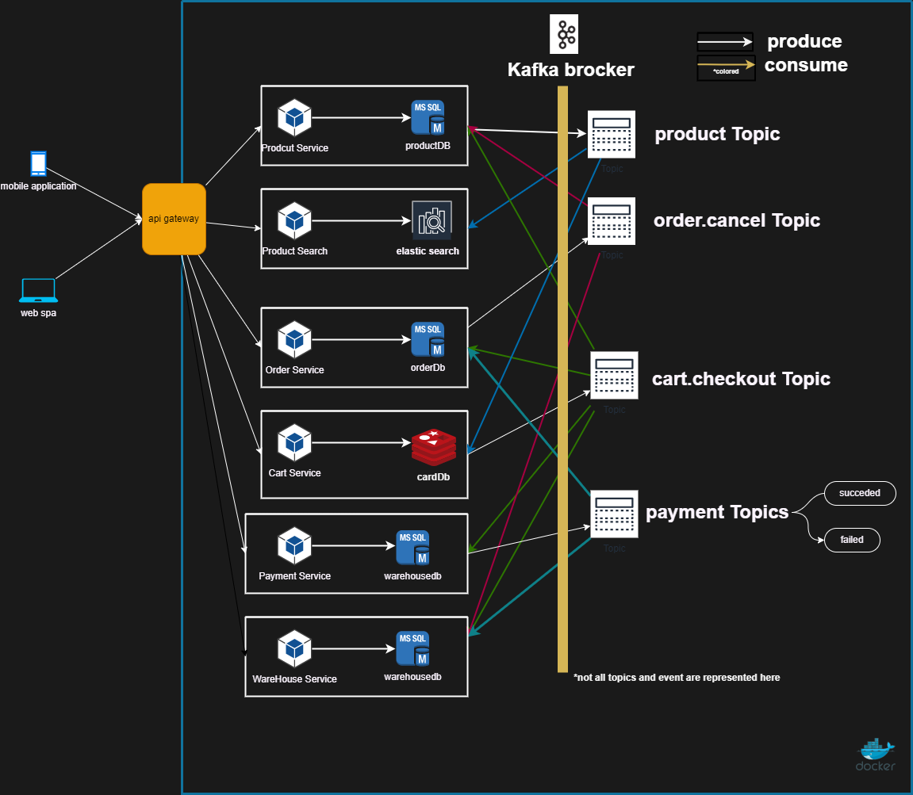

# floward homework

this repository contains the homework for the floward task
# content
- [Microsserice Desigen](#microsserice-desigen)
- [desigen pattern to use](#used-patterns)
- [.net core demo application](#application-demo)
- [unit testing](#test)


# microsserice-desigen
<!-- TDOO to be added components -->
<!-- logging  -->
<!-- service monitoring -->
<!-- zoo keeper -->
<!-- gateway -->

# services
- product service <!-- - cqrs  -->
- product search
- order service <!-- - saga  -->
- cart service 
- payment service <!-- - saga  -->
- warehouse service <!-- - saga  -->



## product service
manage products data with oltp database (sql server) 
that maintatin constrains and relations between tables
peroform update and addition on products data

### interface
- `POST /product/id` add new product
- `DELETE /product/id` delete product
- `PUT /product/id` update product

### topics actions
#### publish
- `product.added` publish when new product added
- `product.deleted` publish when product deleted
- `product.updated` publish when product updated

#### subscribe
- `cart.checkout` subscribe when cart checkout to decrease product quantity
- `order.cancel` subscribe when order canceled to increase product quantity


## product search
perform search on products data with olap database (elasticsearch)
that can be used for search and analytics

### interface
- `GET /product/search` search for products

### topics actions
#### publish
- none

#### subscribe
- `product.added` subscribe when new product added
- `product.deleted` subscribe when product deleted
- `product.updated` subscribe when product updated

## order service
manage orders data with oltp database (sql server)
use saga pattern to handle order process

### interface
- `POST /order/id/cancel` cancel order
- `GET /order/id` get order

### topics actions
#### publish
- `order.cancel` publish when order canceled


#### subscribe
- `cart.checkout` subscribe when cart checkout to create order
- `payment.succeeded` subscribe when payment succeeded to confirm order
- `payment.failed` subscribe when payment failed to cancel order

## cart service
manage cart data with temporal database (redis)

### interface
- `POST /cart/id/checkout` checkout cart
- `GET /cart/id` get cart
- `POST /cart/id/product/id` add product to cart
- `DELETE /cart/id/product/id` remove product from cart

### topics actions
#### publish
- `cart.checkout` publish when cart checkout

#### subscribe
- `product.price.updated` subscribe when product price updated to update cart price

## payment service
manage payment data with persistent database (sql server)

### interface
- `POST /payment/id/succeeded` confirm payment
- `POST /payment/id/failed` cancel payment

### topics actions
#### publish
- `payment.succeeded` publish when payment succeeded
- `payment.failed` publish when payment failed

#### subscribe
- `cart.checkout` subscribe when cart checkout to create payment invoice


## warehouse service
manage warehouse data with oltp database (sql server)

### interface
- none
### topics actions
#### publish
- `warehouse.reserve` publish when warehouse reserve product
- `warehouse.commit` publish when warehouse commit shipping
```
commit shipping requires a payment succeeded and order checkout event to be emited
```
- `warehouse.cancel` publish when warehouse cancel shipping

#### subscribe
- `cart.checkout` subscribe when cart checkout to reserve product
- `payment.succeeded` subscribe when payment succeeded to commit shipping
- `payment.failed` subscribe when payment failed to cancel shipping and remove reservation
- `order.cancel` subscribe when order canceled to remove reservation 

## topics
- `product.added` publish when new product added
- `product.deleted` publish when product deleted
- `product.updated` publish when product updated
- `product.price.updated` publish when product price updated
- `cart.checkout` publish when cart checkout
- `payment.succeeded` publish when payment succeeded
- `payment.failed` publish when payment failed
- `order.cancel` publish when order canceled

### event chronology sample 
- user checkout 
```
cart.checkout 
|
|--> payment create invoice
|
|--> order create Unpaid order
|
|--> warehouse reserve product
|
|--> product update product quantity
```

```
payment.succeeded
|
|--> order confirm order
|
|--> warehouse commit shipping , decrease product quantity
```

```
payment.failed
|
|--> order cancel order
|
|--> warehouse remove reservation
```

```
order.cancel
|
|--> warehouse increase product quantity
|
|--> payment cancel invoice / issue refund
|
|--> product update product quantity
```

### example for succesfull order checkout


## database
- sql server (catalogdb, orderdb, paymentdb)
- elasticsearch (productsearchdb)
- redis (cartdb)

<!-- ## api gateway -->
<!-- ## service discovery -->


# used patterns
## acrchitecture patterns
- microservices
```
services are independent based in business domain
with their own database and api interface and communicate to through message broker
```
- event driven
```
services communicate to each other through message broker
```
- saga
```
saga is used to handle order checkout process
betwean cart , payment , order and warehouse service
```
- cqrs
```
cqrs is used to handle product data
```


## design patterns
### cart microservice
<!-- https://martinfowler.com/eaaCatalog/repository.html -->
- repository pattern 
```
seprate data access from business logic 
used in cart repository with seprate implementation for redis
```

- singleton pattern (Creational PATTERNS)
```
used with message broker to make sure that only one instance of producer is created use same connection for all messaging
```


### suggested patterns (not implemented) 
#### product service
- builder pattern (Creational PATTERNS)
```
build the search query from search parameters
```


# application demo
## overview
this demo application with specified services and database
and imlementationg for cart microservice

## folder structure
```c
├── README.md
├── Src
|   ├── Services
│       ├── CartService 
│           ├── CartService.API 
│           │── CartService.UnitTests
├── docker-compose.yml
├── docker-compose.override.yml
├── diagrams
```

## CartService.API
### overview
- cart service api


## run local-dev
- switch to `Src` folder
- run `docker-compose up` to run da (redis, kafka and zookeeper are used)
- switch to `Src/Services/CartService/CartService.API` folder
-  cart service api
```bash
dotnet run
```


## test 
- switch to `Src/Services/CartService/CartService.UnitTests` folder
- run unit tests
```bash
dotnet test
```

## integration tests
this is done manually using postman 
- import `postman_collection.json` to postman from `Src/Services/CartService/CartService.API/Postman` folder


# ref 
- [microservices pattern chris richardson](https://microservices.io/book)
- [dotnet-architecture/eShopOnContainers](https://github.com/dotnet-architecture/eShopOnContainers)
- [RailsEventStore/ecommerce](https://github.com/RailsEventStore/ecommerce)